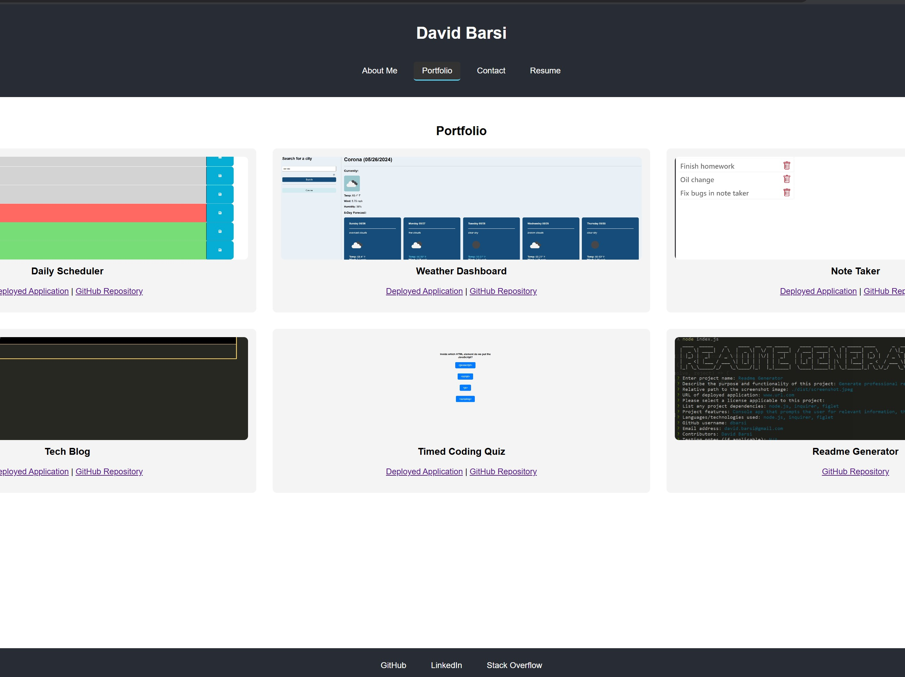

# React Portfolio 
  
  ## Description
  React portfolio to demonstrate concepts learned and projects completed throughout the full-stack bootcamp.
  ## Deployed Application URL
  [App deployed via Netlify](https://sage-chimera-b166d6.netlify.app/)
  ## Screenshot
  
  ## Table of Contents
  * [Features](#features)
  * [Languages & Dependencies](#languagesanddependencies)
  * [Usage](#Usage)
  * [Contributors](#contributors)
  * [Testing](#testing)
  * [Questions](#questions)
  ## Features
  Portfolio with screenshots, links to repo's and deployed apps. Email contact form, downloadable resume.
  ## Languages & Dependencies
  react
  ## Usage:
  HTML, CSS, React.js
  ## Contributors
  n/a
  ## Testing
  npm run start for local
  ## Questions
  Please send your questions [here](mailto:sondavid85@yahoo.com?subject=[GitHub]%20Dev%20Connect) or visit [github/sondavid85](https://github.com/sondavid85).
  